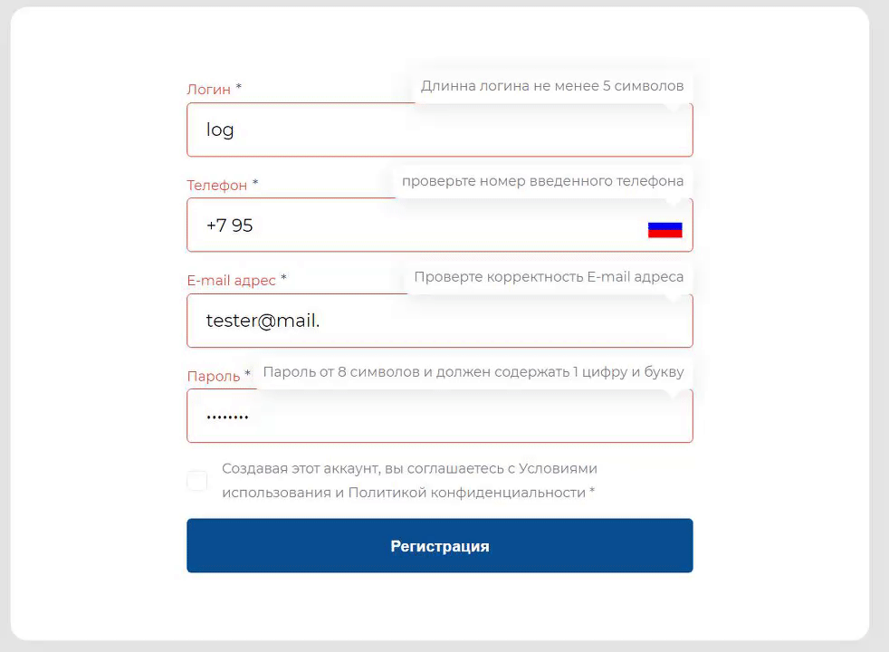

# Vue Form Validate

Vue Form Validate - это Vue 3 плагин для упрощения работы с формами и полями формы.

```text
Модуль находиться в процессе разработки, а документация в процессе уточнения.
```



## Особенности
- Возможность создания своих полей формы
- Полноценная валидация формы
- Async cбор данных формы
- Отслеживание изменений формы
- Полноценные Autocompleate поля
- Возможность разбиение сложных форм на компоненты
- (TODO) Объединение полей формы в группы


## Установка

### Установка плагина
```bash
npm i vue-form-element
```

### Скопировать дефолтные настройки
Скопировать папку example/plugin-install к себе в проект в удобное место.

### Опционально - настроить alias
Для удобства настроить alias (к примеру @field).


## Как это работает
Данный подход основан на использование миксинах (используется вместо наследования).
Такой подход стандартизирует все элементы формы и позволяет общаться с ними одинаково.
И если вы захотите использовать кастомное поле с дейтипкером, то вам будет необходимо один раз написать адаптер.

Все это основано на 3 базовых элементах:
- Формы (FveMixinForm)
- Элементы формы (FveMixinField) и стандартизированный шаблон (FveTemplateField)
- (в процессе разработки) Группа элементов (FveMixinMulti и FveTemplateMulti)


## Пример работы формы на vuetify

Для сравнения возьмем пример vuetify работы с формой (копируем с оф документации)

<details>
<summary><b style="font-size: 1.3em;">пример - vuetify</b></summary>

```vue
<template>
  <validation-observer
    ref="observer"
    v-slot="{ invalid }"
  >
    <form @submit.prevent="submit">
      <validation-provider
        v-slot="{ errors }"
        name="Name"
        rules="required|max:10"
      >
        <v-text-field
          v-model="name"
          :counter="10"
          :error-messages="errors"
          label="Name"
          required
        ></v-text-field>
      </validation-provider>
      <validation-provider
        v-slot="{ errors }"
        name="phoneNumber"
        :rules="{
          required: true,
          digits: 7,
          regex: '^(71|72|74|76|81|82|84|85|86|87|88|89)\\d{5}$'
        }"
      >
        <v-text-field
          v-model="phoneNumber"
          :counter="7"
          :error-messages="errors"
          label="Phone Number"
          required
        ></v-text-field>
      </validation-provider>
      <validation-provider
        v-slot="{ errors }"
        name="email"
        rules="required|email"
      >
        <v-text-field
          v-model="email"
          :error-messages="errors"
          label="E-mail"
          required
        ></v-text-field>
      </validation-provider>
      <validation-provider
        v-slot="{ errors }"
        name="select"
        rules="required"
      >
        <v-select
          v-model="select"
          :items="items"
          :error-messages="errors"
          label="Select"
          data-vv-name="select"
          required
        ></v-select>
      </validation-provider>
      <validation-provider
        v-slot="{ errors }"
        rules="required"
        name="checkbox"
      >
        <v-checkbox
          v-model="checkbox"
          :error-messages="errors"
          value="1"
          label="Option"
          type="checkbox"
          required
        ></v-checkbox>
      </validation-provider>

      <v-btn
        class="mr-4"
        type="submit"
        :disabled="invalid"
      >
        submit
      </v-btn>
      <v-btn @click="clear">
        clear
      </v-btn>
    </form>
  </validation-observer>
</template>

<script>
import { required, digits, email, max, regex } from 'vee-validate/dist/rules'
import { extend, ValidationObserver, ValidationProvider, setInteractionMode } from 'vee-validate'

setInteractionMode('eager')

extend('digits', {
  ...digits,
  message: '{_field_} needs to be {length} digits. ({_value_})',
})

extend('required', {
  ...required,
  message: '{_field_} can not be empty',
})

extend('max', {
  ...max,
  message: '{_field_} may not be greater than {length} characters',
})

extend('regex', {
  ...regex,
  message: '{_field_} {_value_} does not match {regex}',
})

extend('email', {
  ...email,
  message: 'Email must be valid',
})

export default {
  components: {
    ValidationProvider,
    ValidationObserver,
  },
  data: () => ({
    name: '',
    phoneNumber: '',
    email: '',
    select: null,
    items: [
      'Item 1',
      'Item 2',
      'Item 3',
      'Item 4',
    ],
    checkbox: null,
  }),
  
  methods: {
    submit () {
      this.$refs.observer.validate()
    },
    clear () {
      this.name = ''
      this.phoneNumber = ''
      this.email = ''
      this.select = null
      this.checkbox = null
      this.$refs.observer.reset()
    },
  },
}
</script>
```

</details>

Основные плюсы
- Знакомый и привычный синтаксис
- Можно использовать кастомную валидацию для каждого поля

Основные минусы
- нет полноценного submit формы
- нет полноценного clear формы
- большой объем кода на 5 полей (~150 строк)

И давайте вернемся к нашему решению и как данный пример может выглядеть.


## Пример создания той же формы используя Vue Form Validate

<details open>
<summary><b style="font-size: 1.3em;">Пример создания формы</b></summary>

```vue
<template>
  <FveForm>
    <FieldText :field="field.name"/>
    <FieldPhone :field="field.phone"/>
    <FieldEmail :field="field.email"/>
    <FieldSelect :field="field.select"/>
    <FieldCheckbox :field="field.checkbox"/>
    
    <button :disabled="formIsValid" @click="formSubmit">submit</button>
    <button :disabled="formIsChange" @click="formClear">clear</button>
  </FveForm>
</template>

<script>

// form
import FveMixinForm  from 'vue-form-element/src/Fomr/FveMixinForm'
// field
import FieldText     from '@field/FieldText';
import FieldPhone    from '@field/FieldPhone';
import FieldEmail    from '@field/FieldEmail';
import FieldSelect   from '@field/FieldSelect';
import FieldCheckbox from '@field/FieldCheckbox';
//
import {FT_STRING, FT_BOOLEAN} from '@field/type';

export default {
  components: {
    FieldText,
    FieldPhone,
    FieldEmail,
    FieldSelect,
    FieldCheckbox,
  },
  mixins: [ FveMixinForm ],
  
  data: () => ({
    items: [ 'Item 1', 'Item 2', 'Item 3', 'Item 4',],
  }),
  
  methods: {
    formSchema() {
      return {
        name:     { type: FT_STRING(),  label: 'Name',   required: true },
        phone:    { type: FT_STRING(),  label: 'Phone',  required: true },
        email:    { type: FT_STRING(),  label: 'E-mail', required: true },
        select:   { type: FT_STRING(),  label: 'Select', required: true, optionList: this.items },
        checkbox: { type: FT_BOOLEAN(), label: 'Option', required: true },
      }
    }
  },
}
</script>
```

</details>


Данный пример занимает 50 строк кода, примерно 20 из них это базовая конструкция компонента.
Говорить, что все будет идеально и на добавление одного поля будет уходить 3-4 строчки,
это не верно, в реальной жизни это ~10 строчек кода (вместе с логикой).
Отдельно стоит упомянуть о возможности дробить компонент на части, чего трудно приставить при использовании других решений.

Как можем понять из данного примера - валидация ушла в поля. И дальше мы рассмотрим пример создания своего поля


## Пример создания поля используя Vue Form Validate

<details open>
<summary><b style="font-size: 1.3em;">Пример создания простого текстового поля</b></summary>

```vue
<template>
  <div>
    <label>{{field.label}}</label>
    <input
      :type="inputType"
      :name="field.name"
      :placeholder="field.placeholder || ''"
      :readonly="!!field.readonly"
      :disabled="!!field.disabled"
      :value="value.input"
      :required="field.required"
      autocomplete="off"
      @input="inputValueUpdate"
      @keypress.enter.prevent="fieldFormSubmit"
      v-bind="inputAttr"

      ref="input"
    />
  </div>
</template>

<script>

import FveMixinField from 'vue-form-element/src/Field/FveMixinField';

export default {
  name: 'FieldText',
  mixins: [ FveMixinField ],
  data(){
    return {
      inputType: 'text',
      inputAttr: {},
    };
  },
  props: {
    modelValue    : { type: String, required: false },
  },
  methods: {
    // пользовательские действия
    inputValueUpdate($event) {
      this.fieldStoreUpdate({input: $event.target.value});
    },
    // описываем структуру value
    valueSchema() {
      return {
        input: {type: String, default: () => { return ''; } }
      };
    },
    isEmpty(valueObj) {
      return valueObj.input === '' || valueObj.input === null || valueObj.input === undefined;
    },
    validate(valueObj) {
      return null;
    },
    // Установить фокус на текущий элемент
    setFocus(){
      this.$refs.input.focus();
    },
  },
};
</script>

```

</details>

Из данного примера убран общий темплейт, который отвечает за визуальную валидацию.
В остальном это простейший пример создание кастомного поля.


## Пример создания поля используя Vue Form Validate на основе созданного поля

<details open>
<summary><b style="font-size: 1.3em;">Пример создания поля email</b></summary>

```vue
<script>
// Наследуемся от классического поля
import FieldText from '@field/FieldText';

export default {
  name: 'FieldEmail',
  mixins: [FieldText],
  data() {
    return {
      inputType: 'email',
    };
  },
  methods: {
    validate(valueObj) {
      const re =
        /^(([^а-яА-Я<>()[\]\\.,;:\s@\"]+(\.[^а-яА-Я<>()[\]\\.,;:\s@\"]+)*)|(\".+\"))@((\[[0-9]{1,3}\.[0-9]{1,3}\.[0-9]{1,3}\.[0-9]{1,3}\])|(([a-zA-Z\-0-9]+\.)+[a-zA-Z]{2,}))$/;
      if (!re.test(valueObj.input)) {
        return {
          status: 'ERROR',
          code: 'VALIDATE',
          message: 'Проверьте корректность E-mail адреса',
        };
      }
      return null;
    },
  },
};
</script>
```

</details>


## Заключение

Многие формы и поля приходиться затачивать под конкретный проект.
По этой причине, нет возможности использовать одно текстовое поле на все случаи жизни.
В работе некоторых библиотек могут быть ошибки и смена или обновление версии библиотеки, может плачевно сказаться на
всем проекте. Что бы минимизировать данные риски, приходиться писать адаптеры.
По этой же причине, адаптеры полей были вынесены из ядра данного плагина.

До этого (к примеру) один и тот же дейтпикер приходилось поддерживать в множестве вариаций с большим количеством настоек.
Чтоб не быть голословным
- формат отдавания данных (date, moment, dayJs, ...)
- период/дата
- с временем или без (это влияет на формат)
- с возможностью ручного ввода или без
Какие то вещи можно скрестить, а какие то нет.
Это был оверинженеринг, которым будет сложно пользоваться и он не нужен в полном объеме.

Теперь поддержка полей ложиться на рядового разработчика. 
Это дает гибкость и возможность определять какой формат данных будет принимать/отдавать поле.
